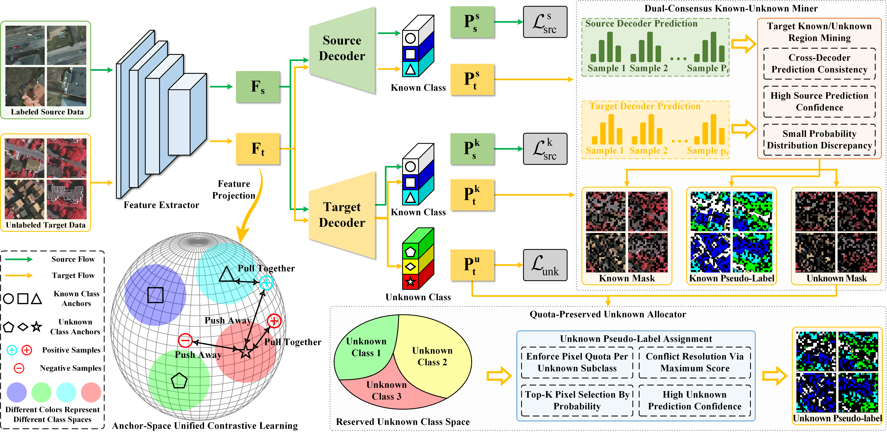
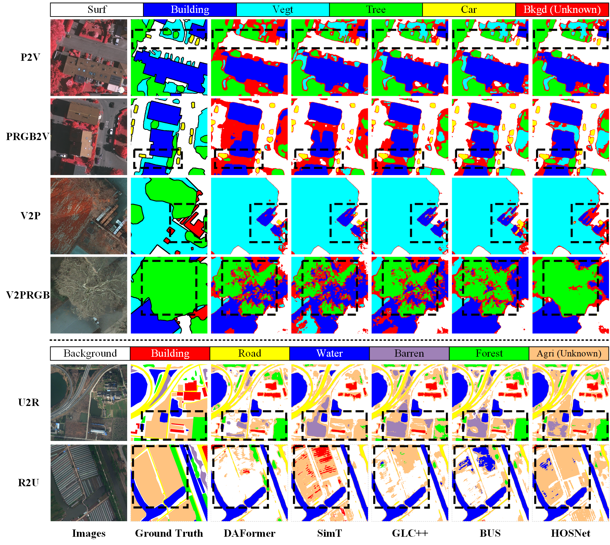
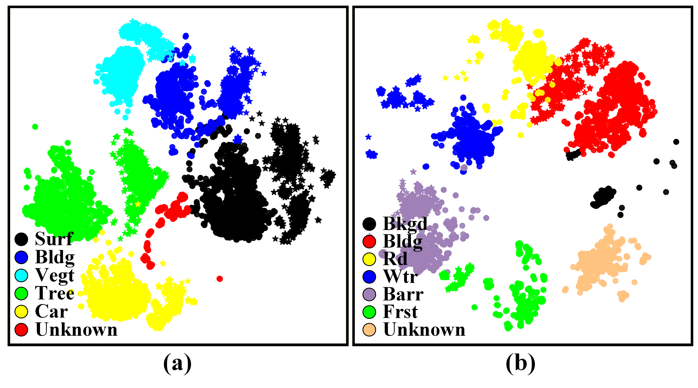

# 🧠 Submission to TGRS 2026：From Rejection to Restoration: Hierarchical Representation Learning for Open-Set Domain Adaptive Remote Sensing Segmentation

🧠 Full source code will be released after the paper is accepted.


 ## 👓Abstract 

Recent studies have shown that unsupervised domain adaptive semantic segmentation (UDASS) has achieved favorable results in remote sensing (RS). However, existing UDASS methods are mainly applicable to closed-set condition and are not well suited to open-set condition, due to the presence of unseen unknown classes in the target domain. Under open-set condition, unknown classes distort the representation space, thereby blurring discriminative boundaries across classes. Moreover, the presence of multiple unknown classes hinders structured unknown-class representation learning. To address the problem mentioned above, a Hierarchical Open-set Segmentation Network (HOSNet) is proposed. First, to purify the representation space of known classes, a Dual-Consensus Known-Unknown Miner (DCKU-Miner) is proposed. DCKU-Miner jointly exploits prediction consistency, confidence, and distribution discrepancy from two complementary decoders to identify reliable known and unknown target features, thereby reducing the unknown-class interference on known-class representation learning. Moreover, to structure the representation space of unknown classes, a Quota-Preserved Unknown Allocator (QPUA) is proposed. QPUA allocates representation capacity to each unknown subclass, alleviating the optimization bias caused by overrepresented unknown classes. Furthermore, to unify the known and unknown representation space, an Anchor-Space Unified Contrastive Learning (AUCL) module is proposed. AUCL uses momentum-updated anchors and a unified contrastive objective to pull features toward assigned anchors and separate them from others, thereby promoting intra-class compactness and inter-class separability. Extensive experiments on the ISPRS and LoveDA benchmarks show that HOSNet outperforms previous methods, achieving average mIoU improvements of 2.15\% and 2.98\%, respectively. 


## ✨Highlight


- A novel HOSNet is proposed for RS open-set UDASS, which restores the representation space and improves adaptability through hierarchical purification, structuring, and unification.
- A DCKU-Miner is proposed to purify the known-class representation space. It distinguishes reliable known and unknown target features through dual-consensus mining over complementary decoder branches by jointly considering prediction consistency, confidence, and distribution discrepancy.
- A QPUA is proposed to structure the unknown representation space. It assigns reserved representation capacity to each unknown subclass through quota-preserved top-response selection, thereby reducing the optimization bias caused by overrepresented unknown categories.
- A AUCL module is proposed to unify known and unknown representations. It improves intra-class compactness and inter-class separability through anchor-guided contrastive learning with momentum-updated class anchors.


## 💡Method Overview




## 👀Visualization
### 👀Ablation visualization on the ISPRS and LoveDA datasets. 


### 👀t-SNE visualization of feature representations.




## 📦Usage

### 📦Datasets 
All datasets including [ISPRS](https://www.isprs.org/education/benchmarks/UrbanSemLab/2d-sem-label-potsdam.aspx) dataset and [LoveDA](https://github.com/Junjue-Wang/LoveDA) dataset.


### 🚀Training 
```
CUDA_VISIBLE_DEVICES=1 nohup python -u tools/train.py > train.log 2>&1 &
```


## 📊 Results 

### 📊 Results on the ISPRS dataset

| Method | Domain | Surf | Bldg | Vegt | Tree | Car | Bkgd | mIoU (%) | Domain | Surf | Bldg | Vegt | Tree | Car | Bkgd | mIoU (%) |
|--------|--------|------|------|------|------|-----|------|----------|--------|------|------|------|------|-----|------|----------|
| DAFormer | P2V | 67.98 | 77.92 | 43.72 | 64.09 | 43.72 | 0.01 | 49.57 | PRGB2V | <u>70.01</u> | **78.93** | 15.83 | 18.02 | 51.62 | 0.05 | 39.08 |
| HRDA | P2V | 70.07 | 74.23 | 40.34 | 63.99 | 50.38 | <u>0.61</u> | 49.94 | PRGB2V | **71.33** | 71.43 | 14.04 | 26.71 | 51.54 | <u>0.70</u> | 39.29 |
| MIC | P2V | 65.28 | 76.92 | 45.05 | 63.85 | <u>54.37</u> | 0.03 | 50.92 | PRGB2V | 58.60 | 70.85 | 17.89 | 23.64 | <u>62.15</u> | 0.21 | 38.89 |
| SimT | P2V | <u>70.39</u> | <u>81.28</u> | 46.75 | <u>64.18</u> | 47.13 | 0.35 | 51.68 | PRGB2V | 63.67 | 75.79 | 22.96 | 47.75 | 46.62 | 0.08 | 42.81 |
| MAOSDAN | P2V | **70.57** | 74.82 | **55.24** | 36.16 | **74.16** | 0.17 | 51.85 | PRGB2V | 61.51 | 62.64 | **48.36** | 12.12 | **70.78** | 0.09 | 42.58 |
| GLC++ | P2V | 69.42 | 80.55 | <u>52.81</u> | 61.14 | 48.69 | 0.08 | 52.12 | PRGB2V | 56.74 | 68.18 | <u>37.84</u> | 52.86 | 41.11 | 0.68 | 42.90 |
| BUS | P2V | 67.31 | 79.50 | 49.93 | 63.83 | 53.04 | 0.03 | <u>52.27</u> | PRGB2V | 57.88 | 67.36 | 31.81 | <u>56.20</u> | 47.26 | 0.29 | <u>43.47</u> |
| **HOSNet** | P2V | 68.16 | **85.94** | 46.48 | **73.15** | 48.64 | **0.62** | **53.83** | PRGB2V | 58.08 | <u>76.58</u> | 24.17 | **62.69** | 48.56 | **0.71** | **45.13** |
| | | | | | | | | | | | | | | | | | |
| DAFormer | V2P | 65.51 | 67.21 | 53.63 | 29.19 | 68.70 | 2.71 | 47.82 | V2PRGB | 58.94 | 70.40 | 28.68 | 22.89 | 70.58 | 2.38 | 42.31 |
| HRDA | V2P | 67.53 | 69.74 | 54.46 | **35.50** | 71.54 | 2.70 | 50.24 | V2PRGB | **66.97** | 68.77 | 26.73 | **24.45** | 76.33 | 2.32 | 44.26 |
| MIC | V2P | <u>70.53</u> | 76.78 | 48.13 | 8.25 | <u>82.62</u> | 3.80 | 48.35 | V2PRGB | 57.91 | <u>75.65</u> | 44.80 | 9.55 | <u>78.27</u> | 3.30 | 44.91 |
| SimT | V2P | 67.14 | **78.22** | 52.79 | 27.61 | 71.15 | 3.97 | 50.15 | V2PRGB | 63.57 | 71.10 | **51.84** | 10.34 | 67.59 | 3.96 | 44.73 |
| MAOSDAN | V2P | 68.39 | 72.64 | 54.52 | 33.40 | 70.21 | <u>4.98</u> | 50.69 | V2PRGB | 63.46 | 65.47 | <u>51.27</u> | 15.61 | 69.25 | 4.73 | 44.97 |
| GLC++ | V2P | 67.24 | 72.00 | 54.22 | <u>34.02</u> | 70.26 | 4.77 | 50.42 | V2PRGB | 62.45 | 64.48 | 50.90 | 14.01 | 67.00 | <u>4.99</u> | 43.97 |
| BUS | V2P | 65.56 | 75.91 | <u>55.07</u> | 32.63 | 71.59 | 3.58 | <u>50.72</u> | V2PRGB | 57.30 | 71.66 | 44.86 | <u>24.17</u> | 71.06 | 3.82 | <u>45.48</u> |
| **HOSNet** | V2P | **73.08** | <u>77.17</u> | **55.81** | 24.76 | **83.25** | **6.15** | **53.37** | V2PRGB | <u>66.36</u> | **77.36** | 48.09 | 9.75 | **80.81** | **6.74** | **48.19** |


### 📊 Results on the LoveDA dataset

| Method | Domain | Bkgd | Bldg | Rd | Wtr | Barr | Frst | Agri | mIoU (%) | Domain | Bkgd | Bldg | Rd | Wtr | Barr | Frst | Agri | mIoU (%) |
|--------|--------|------|------|----|-----|------|------|------|----------|--------|------|------|----|-----|------|------|------|----------|
| DAFormer | U2R | 28.98 | 31.92 | 27.12 | 38.09 | 13.72 | 16.88 | 5.07 | 23.11 | R2U | 42.43 | 41.04 | 33.71 | 63.54 | 27.95 | 47.60 | 5.85 | 37.45 |
| HRDA | U2R | 29.23 | 32.34 | 27.99 | 49.38 | 13.72 | 5.28 | 5.92 | 23.41 | R2U | <u>45.89</u> | 40.65 | 33.15 | 65.20 | 28.67 | 44.79 | 4.96 | 37.62 |
| MIC | U2R | 33.05 | 29.85 | 26.37 | 45.03 | 13.39 | 13.28 | 4.75 | 23.67 | R2U | 43.75 | 40.62 | 33.08 | 65.51 | 26.64 | 44.36 | 5.12 | 37.01 |
| SimT | U2R | 28.18 | <u>33.13</u> | 29.35 | 47.57 | <u>14.82</u> | 10.24 | 5.16 | 24.06 | R2U | 43.78 | 42.09 | 32.74 | 59.18 | <u>33.84</u> | 45.86 | 5.11 | 37.51 |
| MAOSDAN | U2R | 30.16 | **33.17** | <u>30.42</u> | 43.55 | 14.81 | 16.14 | 5.69 | 24.85 | R2U | 43.68 | 41.88 | 33.36 | 59.81 | 32.20 | 44.26 | 5.29 | 37.21 |
| GLC++ | U2R | <u>37.08</u> | 30.31 | 24.50 | <u>47.93</u> | **14.83** | **18.04** | <u>7.03</u> | 25.67 | R2U | **46.51** | 40.21 | <u>39.63</u> | 61.19 | 28.70 | <u>47.71</u> | 5.53 | 38.50 |
| BUS | U2R | 35.01 | 32.93 | 29.83 | 47.32 | 14.67 | <u>17.76</u> | 6.33 | <u>26.26</u> | R2U | 45.74 | <u>46.46</u> | 39.50 | <u>65.54</u> | 30.70 | 47.53 | <u>6.78</u> | <u>40.32</u> |
| **HOSNet** | U2R | **47.89** | 31.16 | **32.43** | **57.26** | 9.00 | 13.97 | **8.31** | **28.57** | R2U | 28.78 | **54.96** | **52.33** | **72.25** | **41.45** | **50.20** | **7.84** | **43.97** |


<!--
## 📝 Citation 

If you use our dataset or code for research, please cite this paper: 

```
@article{FANG2026115625,
  title = {A global linear attention network for semantic segmentation of remote sensing images},
  journal = {Knowledge-Based Systems},
  volume = {339},
  pages = {115625},
  year = {2026},
  issn = {0950-7051},
  doi = {https://doi.org/10.1016/j.knosys.2026.115625},
  author = {Yiwei Fang and Chunhua Li and Xin Li and Xin Lyu and Zhennan Xu}
}
```
-->

<!--
## ⭐Acknowledgment
Our implementation is mainly based on following repositories. Thanks for their authors.
* [MMSegmentation](https://github.com/open-mmlab/mmsegmentation)
* [Rein](https://github.com/w1oves/Rein)
* [CrossEarth](https://github.com/Cuzyoung/CrossEarth)
* [CDG](https://github.com/seabearlmx/CDG)
-->


## 📧Contact

If you encounter any problems or bugs, please don't hesitate to contact me at [yiweifang@hhu.edu.cn](mailto:yiweifang@hhu.edu.cn). 
